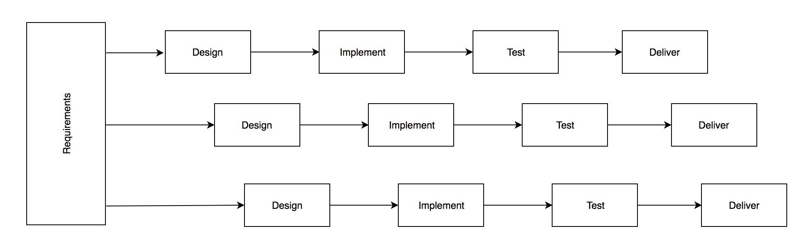
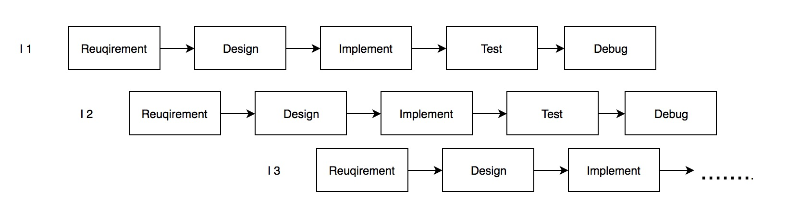
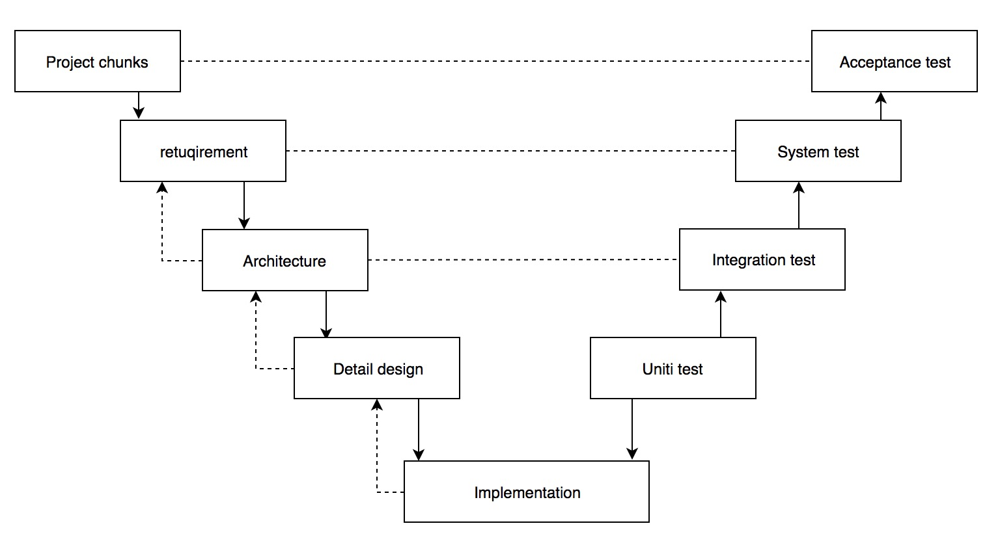

# Life-cycle model

### Waterfall Model

Advantages:

* well documented
* works well for well understand problems

Disadvantage:

* high risk of building the wrong system\( because of late feedback from customer \)

-------------------------------------------------------------------------------------------------------------------

### Incremental Development

Advantages:

* frequent feedback from customer address the risk of building the wrong system
* clear requirements up front for contracting

Disadvantage:

* requirements still rigid, and could be wrong

-------------------------------------------------------------------------------------------------------------------

### Evolutionary Development

* everything includes requirements is evolving 

Advantage:

* risk addressed through frequent feedback, including for requirements

Disadvantage:

* build-and-fix danger

-------------------------------------------------------------------------------------------------------------------

### V-model

* waterfall + more detailed verification + validation structure

Advantages:

* highly structured + well-documented development method
* * predominantly used in large projects
*  often involving hardware
* * automotive, railway, defense

Disadvantage:

* same as waterfall

